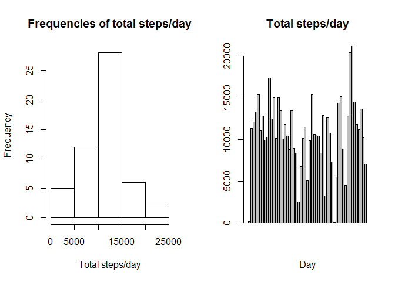
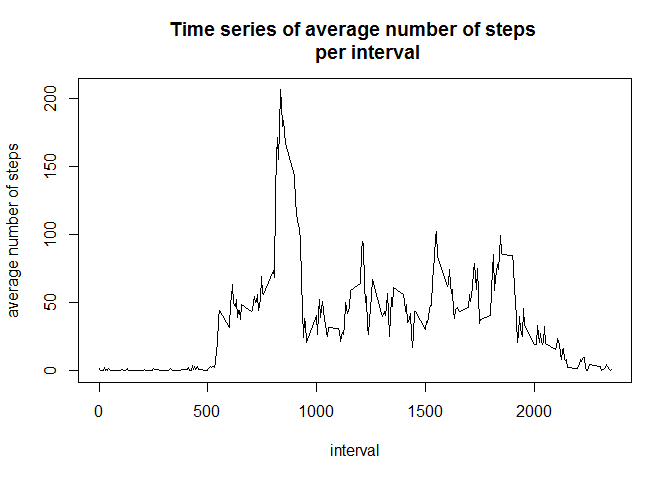
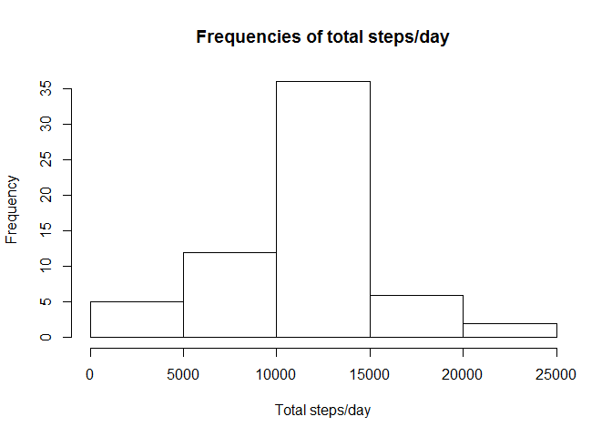
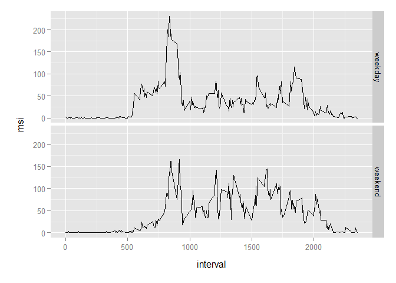

# Reproducible Research: Peer Assessment 1


## Loading and preprocessing the data

```r
zipname <-"./activity.zip"
unzip_names<-unzip(zipname,list = TRUE)$Name
unzip_names<-paste("./",unzip_names ,sep="")
if(!file.exists(unzip_names[1])) { unzip(zipname)}
ActMonDa <- read.csv(unzip_names[1])
```

## What is mean total number of steps taken per day?
Ignore MissingValues and calculatie total steps per date.

```r
NoMissValues<-ActMonDa[!is.na(ActMonDa$steps),]
steps_day<-summarize(group_by(NoMissValues,date),sum=sum(steps))
```
Create histogram and barplot in two panels:

```r
if(!file.exists("figure")) { dir.create("figure")}
par(mfrow = c(1, 2))
hist(steps_day$sum, main="Frequencies of total steps/day", xlab="Total steps/day")
barplot(steps_day$sum, main="Total steps/day",xlab="Day")
```

 

```r
invisible(dev.copy(png, file = "./figure/plot1.png",width=640,height=480))
invisible(dev.off())
```
Calculate mean and median of total steps per day:

```r
mean_tonumstday<-mean(steps_day$sum)
median_tonumstday<-median(steps_day$sum)
```
The mean total number of steps taken per day is 10766.19 and median total number of steps taken per day is 10765, not being equal.

## What is the average daily activity pattern?

```r
mean_steps_interval<-summarize(group_by(NoMissValues,interval),msi=mean(steps))
par(mfrow = c(1, 1))
plot(mean_steps_interval,type="l",main="Time series of average number of steps 
     per interval",ylab="average number of steps")
```

 

```r
invisible(dev.copy(png, file = "./figure/plot2.png",width=480,height=480))
invisible(dev.off())
```
5-minute interval, on average across all days in the dataset, containing the maximum number of steps:

```r
max_steps <- mean_steps_interval[order(-mean_steps_interval$msi),][1,1:2]
```
Of the 5-minute intervals, on average across all the days in the dataset, no 835 contains the maximum number of steps being 206.17, being the 8:35 am interval.

## Imputing missing values
Calculate the number of missing (steps-)values in the dataset by counting the number of rows with missing data = number of missing values in dataset.

```r
missing_v <- nrow(ActMonDa[is.na(ActMonDa$steps),])
```
The number of missing (steps-)values in the dataset is equal to the number of rows with missing data is 2304.

I propose to fill in missing values with the mean for the respective 5-minute interval.
I start by copying the df and replace the missing values, then impute the missing values, finally calculatie total steps per date.

```r
FilledMissing<-ActMonDa
for(i in 1:nrow(FilledMissing)){
        if (is.na(FilledMissing[i,]$steps)){
                this_inter<-FilledMissing[i,]$interval
                FilledMissing[i,]$steps<-mean_steps_interval[mean_steps_interval$interval==this_inter,]$msi
        }
} 
new_steps_day<-summarize(group_by(FilledMissing,date),sum=sum(steps))
```
Create histogram of the total number of steps per day:

```r
hist(new_steps_day$sum, main="Frequencies of total steps/day", xlab="Total steps/day")
```

 

```r
invisible(dev.copy(png, file = "./figure/plot3.png",width=480,height=480))
invisible(dev.off())
```
The number of days in the category [10000,15000] steps per day is greater, 36 vs 28 in the previous analysis. This is due to the fact we used averaged data to fill in the NA's.
Calculate mean and median of total steps per day:

```r
new_mean_tonumstday<-mean(new_steps_day$sum)
new_median_tonumstday<-median(new_steps_day$sum)
```
The mean total number of steps taken per day is 10766.19 and median total number of steps taken per day is 10766.19, being equal, only marginally different from the values in the first part of the assignment. Since average period values, being non-integer values, are used to fill in the NA's this is not a surprise.

## Are there differences in activity patterns between weekdays and weekends?
Create this new factor variable indicating whether a date is weekend or weekday:

```r
what <- function(x){ifelse(x=="zondag"|x=="zaterdag","weekend","weekday")
         }
FilledMissing$whatday<-factor(what(weekdays(as.Date(FilledMissing$date))))
mean_st_inter_wd<-summarize(group_by(FilledMissing,interval,whatday),
                            msi=mean(steps))
```


```r
library(ggplot2)
qplot(interval, msi, data = mean_st_inter_wd, facets = whatday~., binwidth = 2,
      geom = "line")
```

 

```r
ggsave("./figure/plot4.png")
```
The weekend pattern is more equally distributed over over the daytime hours. The activity pattern for weekdays starts earlier and has has a much higher peak at about 8 am.
